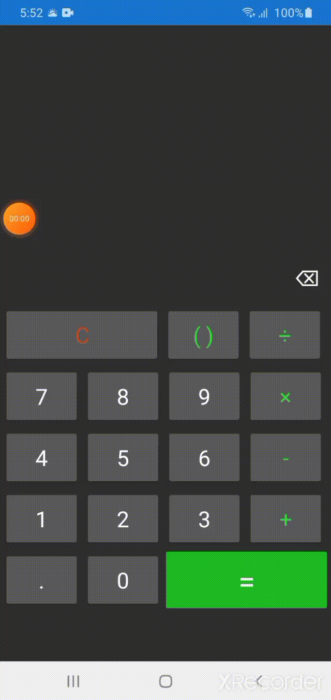

# Calculator
## My Third Android app with Xamarin(C#) framework.

Hello, My name is Abdella Solomon, This is a Calculator that is made using xamarin C# framework.
You can add, subtract, multiply and divde numbers.

## How to run the code?
To run the code, you have to download the apk under the release page here https://github.com/Abdesol/calculator_xamarin/releases/tag/1.1 then, install it on your phone.

## How it works?
 

I hope you enjoyed the app.
If you enjoyed the app don't forget to like the repo :)
Any feedback is Acceptable!
